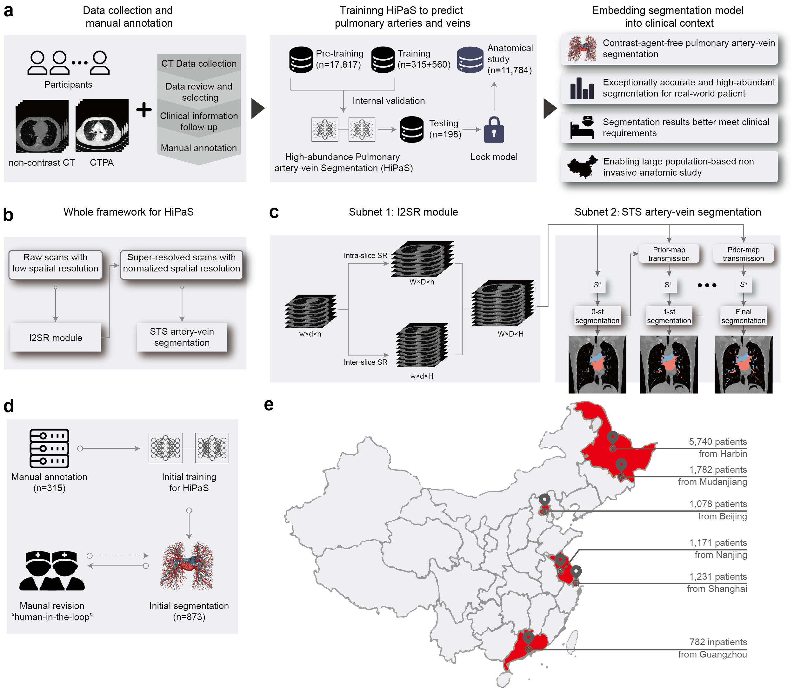
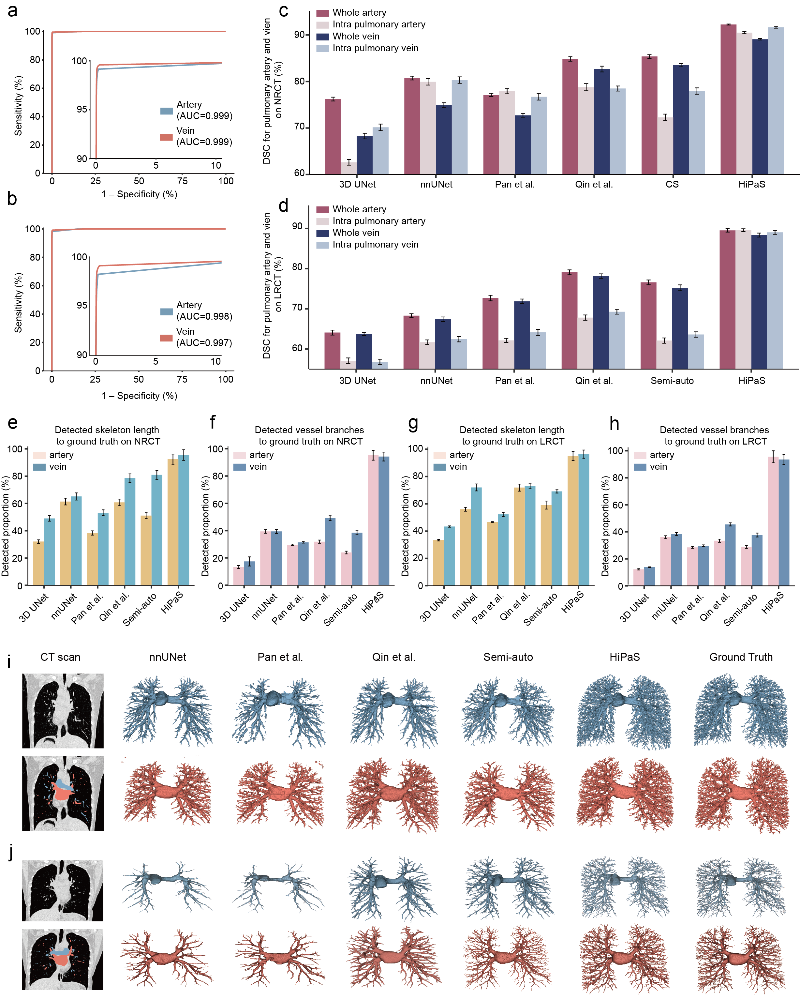
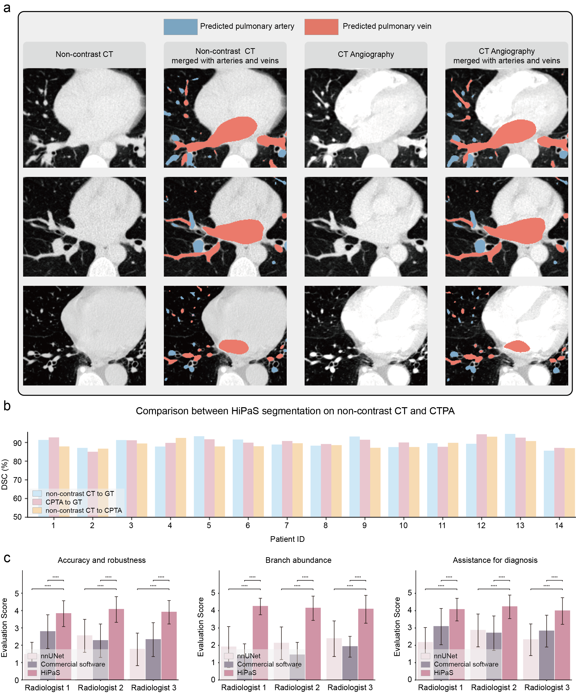
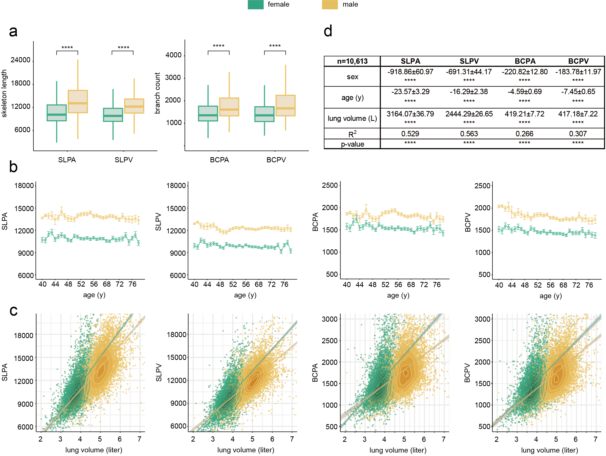

# HiPaS: High-abundant Pulmonary Artery-vein Segmentation

**[Nature Communications 2025]** Deep learning-driven pulmonary artery and vein segmentation reveals demography-associated vasculature anatomical differences

[📄 Paper](https://doi.org/10.1038/s41467-025-56505-6) · [📦 Dataset (Zenodo)](https://zenodo.org/records/14879605) · [✉️ Contact](mailto:yuetan.chu@kaust.edu.sa)


---

## Overview

HiPaS is a framework for accurate, high-abundant pulmonary artery-vein segmentation on both non-contrast CT and CTPA. It consists of two modules:

- **I2SR** — an inter-and-intra-slice super-resolution module that normalises CT scans to a consistent spatial resolution before segmentation.
- **STS** — a cascaded four-stage Saliency-Transmission Segmentation module that progressively segments vessels from coarse to fine, using the output of each stage as a spatial prior for the next.

> **Note on checkpoints.** Due to commercialization and patent policies, the final trained weights are not publicly available. For a simpler, deployable alternative, see [Simple_AV_seg](https://github.com/Tohsaka194/Simple_AV_seg).

> We also provide a minimal **HiPaS_Slicer** as a Slicer demo for easier local testing and visualization. The demo allows users to load a standard NIfTI CT volume in 3D Slicer, run the simplified artery-vein segmentation pipeline through an external Python environment, and automatically load the generated artery, vein, and lung masks back into the Slicer scene as label volumes.


---

## Installation

```bash
conda create -n HiPaS python=3.8
conda activate HiPaS
pip install -r requirement.txt
```

The `requirement.txt` includes all packages used across the full platform. Not every package is required for inference alone — install selectively if disk space is a concern.

**Tested environment:** Python 3.8, PyTorch 2.x, CUDA 12.x, MONAI 1.x.

---

## Dataset

Approximately 250 chest CT scans with artery-vein annotations are publicly available on [Zenodo](https://zenodo.org/records/14879605). The annotations follow the PARSE22 challenge standard, covering vessel levels up to Stage 2 (3–5 branch levels), as illustrated in Supplementary Figure 6c of the paper.

**File format:** NumPy compressed archives (`.npz`), with each array stored under the key `"data"`.

```python
import numpy as np

ct     = np.load("ct_scan/001.npz",          allow_pickle=True)["data"]  # shape (D, H, W), float32
artery = np.load("annotation/artery/001.npz", allow_pickle=True)["data"] # shape (D, H, W), binary
vein   = np.load("annotation/vein/001.npz",   allow_pickle=True)["data"] # shape (D, H, W), binary
```

CT values are normalised from the HU window `[−1000, 600]` to `[0, 1]` and resampled to a normalised spatial resolution (approximately 0.65 × 0.65 × 1.00 mm³, volume shape 512 × 512 × 512).

---

## Inference

Run `HiPaS/predict_av.py` to segment a CT volume into pulmonary arteries and veins. Edit the paths at the bottom of the script to point to your CT file and model checkpoints:

```python
# In HiPaS/predict_av.py — bottom of file
ct = np.load("/your/data/ct.npz")["data"]
ct = np.clip((ct + 1000) / 1400, 0, 1)   # if CT is in raw HU
artery, vein = predict_av(ct)
```

Model checkpoint paths (`MODEL_DIR` and `NUM_STAGES`) are configured at the top of the file. Inference on a single volume takes approximately 2 minutes on an A100 GPU.

---

## Training

This section describes how to reproduce the STS training pipeline described in the paper. Training requires a dataset with **four levels of cumulative artery-vein annotations** per CT volume (see *Data format* below).

### Data format

Organise your dataset as follows. Each sample requires five `.npz` files:

```
data/
├── patient_001/
│   ├── ct.npz          # CT scan, key="data", shape (D, H, W), normalised to [0, 1]
│   ├── filter.npz      # Jerman vesselness filter of ct, key="data", shape (D, H, W), in [0, 1]
│   ├── mask_lv0.npz    # Level 0 cumulative mask (cardinal vessels inside heart)
│   ├── mask_lv1.npz    # Level 1 cumulative mask (hilum, 1–2 branch levels)
│   ├── mask_lv2.npz    # Level 2 cumulative mask (3–5 branch levels)
│   └── mask_lv3.npz    # Level 3 cumulative mask (all visible vessels)
├── patient_002/
│   └── ...
```

Each mask file contains a **two-channel array** (`key="data"`, shape `(2, D, H, W)`) where channel 0 is the artery mask and channel 1 is the vein mask. Masks are **cumulative**: level *i* includes all vessels from levels 0 through *i*.

Then create two JSON index files listing the training and validation samples:

```json
[
  {
    "ct":     "data/patient_001/ct.npz",
    "filter": "data/patient_001/filter.npz",
    "mask_0": "data/patient_001/mask_lv0.npz",
    "mask_1": "data/patient_001/mask_lv1.npz",
    "mask_2": "data/patient_001/mask_lv2.npz",
    "mask_3": "data/patient_001/mask_lv3.npz"
  }
]
```

Save these as `data/train.json` and `data/val.json`, and set the paths in `av_training/config.yaml`.

To compute the Jerman vesselness filter for a CT volume:

```python
from filter import jerman_filter_scan
import numpy as np

ct = np.load("data/patient_001/ct.npz")["data"]  # already normalised to [0, 1]
filt = jerman_filter_scan(ct, enhance=True)
np.savez_compressed("data/patient_001/filter.npz", data=filt)
```

### Step 1 — Train Stage 0

Edit `av_training/config.yaml`:

```yaml
training:
  stage: 0
  pretrained_stage_paths: []
  checkpoint_dir: "checkpoints/stage_0"
```

Then run:

```bash
cd av_training
python train.py --config config.yaml
```

### Step 2 — Precompute priors for Stage 1

Before training Stage 1, run the frozen Stage 0 model over all training and validation samples to generate prior probability maps. These are saved alongside each CT file and automatically loaded by the dataset class.

```bash
python precompute_prior.py \
  --config config.yaml \
  --model checkpoints/stage_0/best.pth \
  --source-stage 0 \
  --data-list data/train.json data/val.json
```

### Step 3 — Train Stage 1

Edit `config.yaml`:

```yaml
training:
  stage: 1
  pretrained_stage_paths: ["checkpoints/stage_0/best.pth"]
  checkpoint_dir: "checkpoints/stage_1"
```

Run `python train.py --config config.yaml`. Repeat Steps 2–3 for Stages 2 and 3, extending `pretrained_stage_paths` and updating the `source-stage` argument accordingly.

### Key hyperparameters

| Parameter | Value | Description |
|-----------|-------|-------------|
| Patch size | 192 × 192 × 128 | Random crop during training |
| Optimizer | Adam | lr = 1e-4, β = (0.9, 0.999) |
| Loss | Weighted Dice + Overlap | Eq. 13–17 in the paper |
| Model | HiPaSNet | mid\_channels=24, r=4 |

---

## Results

### Workflow



### Segmentation performance



### Clinical evaluation



### Anatomical study



---

## Citation

```bibtex
@article{chu2025hipas,
  title   = {Deep learning-driven pulmonary artery and vein segmentation reveals
             demography-associated vasculature anatomical differences},
  author  = {Chu, Yuetan and Luo, Gongning and Zhou, Longxi and others},
  journal = {Nature Communications},
  volume  = {16},
  pages   = {2262},
  year    = {2025},
  doi     = {10.1038/s41467-025-56505-6}
}
```
